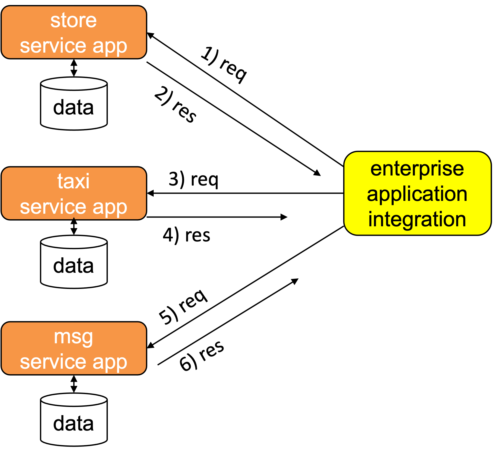
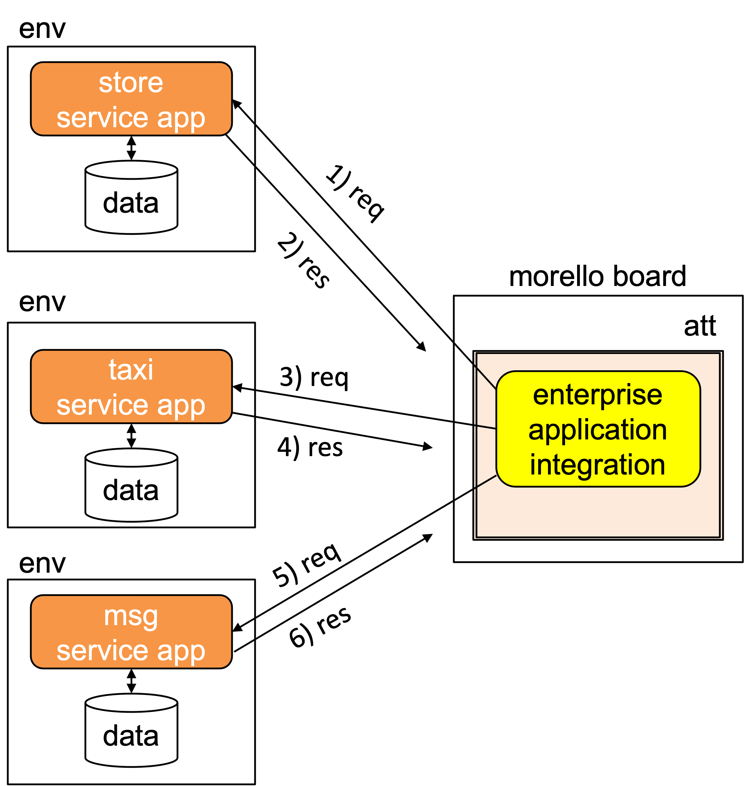
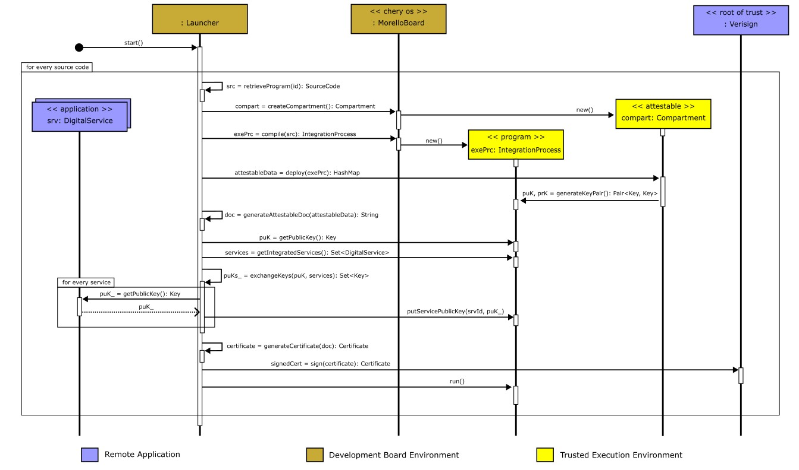
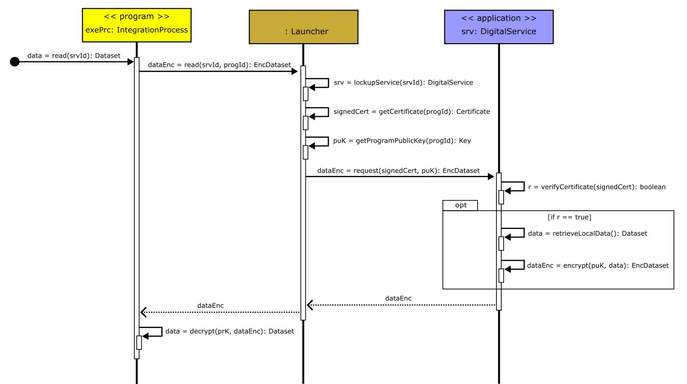
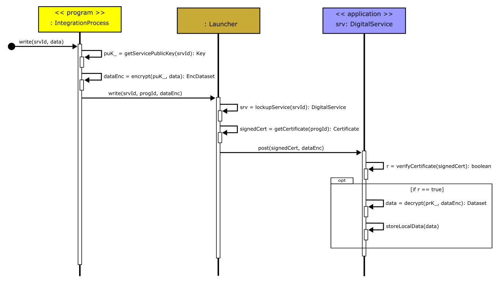

# A use-case for attestable evaluation
=======

We are interested in evaluating two attestable properties:  
 
- the operation of the cloud-based attestation procedure discussed in - [attestablelauncher repository](https://github.com/CAMB-DSbD/attestablelauncher "Git repository")

- some performance properties of the attestbables created
on a Morello Board with the assistance of the library
compartmentalisation tool.

To this end, we have implemented an Enterprise Application 
Integration (EAI) also called Integration Solution that 
operates as follows:

In this use case, a store offers free taxi rides
back home to clients that spend at least 
150.00 punds in the store. The problem can be solved 
by an an application integration that integrates 
three independent components: a store service, a 
taxi service and a messaging service.
The latter (for example, whatsapp) is used by the 
store to notify shoppers that are entitled to free 
taxis that a courtesy taxi is available for them. 

## Conceptual view of the EAI
A conceptual view of the application involved in
the EAI is shown in Fig. 

  

 

In the implementation 
that we have discussed here, the
component applications (store, taxi and msg) play 
the role of servers against which the
EAI operating as a client, places requests.
The figure follows a message development where
 
1. The EAI request a copy of the bill of the
   store's client, say Alice's.

1. The stores replies with the bill amount. Let us assume that
   it is above 150.00 pounds, thus, Alice is entitled to a 
   courtesy taxi.

1. The EAI sends a taxi request to the
    taxi service.

1. The taxi service responds with a taxi's
    number and driver's name ready for boarding.

1. The EAI sends Alice a taxi offer.

1. Alice responds with an acceptance.
 

## Implementation architecture of the EAI
In the figure, we assume that the implementation of 
the EAI is delegated to a third company (say, Bob's) 
and that four parties involved do not necessarily trust 
each other. For example, the store, taxi and msg services 
are reluctant to provide their data to the EAI unless 
Bob implement mechanisms that guarantee that the data 
will be protected at execution time. This is a requirement
that the implementation needs to satisfy.
As shown in the following figure, we use an 
attestable to meet this requirement in our 
implementation.

  

 

In the figure, we use the following notation. The
applications (storage, taxi, msg) execute in conventional
platforms, this is represented by the *env* boxes 
drawn with single lines. The attestable (att) is 
represented by a double line box to indicate that it 
is an execution environment that guaratees data 
protection properties. The Enterprise Application 
Integration (EAI) is deployed and executed inside the
attestable to protect the data that the applications
provide to the EAI. We remark that the EAI is a client
of the three servers (store, taxi and msg) and as
such, it is programmed to place requests periodically.

 
To remark the practicality of our current implementation
we mention that the attestable is created in a Morello
Board physically located in Toronto. The applications
are run in conventional computer physically located in
the premisis of the Applied Computing Research Group
of the University of Ijui, Brazil.
 

### Functionality of the components  

1) App-Store, App-Transport and App-Whatsapp
- Each of these directories contains an API (API1.py, API2.py, API3.py), a database (compras.db, transport_app.db), and a key pair (cert.pem, priv.pem).
- The APIs are responsible for providing specific endpoints:
 - API1.py (App-Store): Provides the /api/sales endpoint to check the last sale.
 - API2.py (App-Transport): Provides the /api/trips endpoint to book a trip.
 - API3.py (App-Whatsapp): Provides the /send-message endpoint to send a confirmation message via WhatsApp.
   
2) Launcher
- launcher.py: A server that manages the upload, compilation and execution of programs inside a TEE at compartments. It runs on the operating system outside the TEE and handles upload requests, compiles the C code (integration_process.c) written with cheri-caps, and allows the generated binary code to be executed inside a single compartment. It also creates and store the required certificates locally outside the TEE on the operating system.
- command-line-interface.py: A command line client interface (CLI) for interacting with the server (launcher.py), allowing to list files, upload, delete, compile and run programs.
- generate_certificate.py: Generates the certificates and keys for the integration_process executable binary code. It includes information such as CPU model, number of CPUs, memory addresses, hash of the executable binary code and its signature to the certificate.
- Programs and Data:
 - programs-data-base/sources: Contains the program source codes written in C language (e.g. integration_process.c).
 - programs-data-base/cheri-caps-executables: Contains the executable binary codes generated for cheri-caps.
 - programs-data-base/certificates: Contains the attestables and the keys generated for the execution environment of each executable binary code.
 - attestable-data/signatures: Contains the signatures of the executable binary codes.
  
 

## Attestation and set up of the attestable
The integration process compilation and execution is managed by a laucher program that runs outside the trusted execution environment but still inside the Morello Board operating system. In this case study, our integration process program acts as a client by invoking the remote servers represented by the digital services apps.

  

 

1) Launcher initialisation
 - The launcher is started by running launcher.py.
 - The launcher is ready to receive requests to upload, compile and run programmes.
2) Code upload
 - The CLI (command-line-interface.py) is used to upload a C program (ex. integration_process.c) to the Morello Board Environment.
 - The launcher saves the uploaded file in the programs-data-base/sources folder and updates the file_database.json.
3) Code compilation
 - The request to compile the source code is made via the CLI.
 - The launcher compiles the source code for cheri caps and saves the executable binary code in folder programs-data-base/cheri-caps-executables.
 - A corresponding certificate directory is created inside the folder programs-data-base/certificates.
4) Code execution
 - The compiled binary code is executed via the CLI.
 - The launcher executes the binary and returns the output.
5) Certificate generation
 - During execution, the integration_process.c calls the generate_certificate.py located inside folder attestable-data.
 - The generate_certificate.py script generates the corresponding keys and certificates for the running executable binary code, including information such as CPU model, number of CPUs, and memory addresses.
6) Interaction with External APIs
 - The integration_process.c makes HTTPS calls to the defined APIs (API1_URL, API2_URL, API3_URL), using OpenSSL to check sales, book trips and send confirmation messages via WhatsApp.

## Execution of a read operation
The following diagram shows the development of the
execution of a read operation that the EAI executes
against one of the applications (for example,
the storage) to request data.

  

 

## Execution of a write operation
The following diagram shows the development of the
execution of a write operation that the EAI executes
against one of the applications to send it some data. 
For example, the EAI executes a write operation against
the msg application to notify it that a client is ready
for a taxi ride to go home.

  

 

## Performance properties of the attestable
We have placed the code and some preliminary results in the
[tee-morello-performance-experiments  repository](https://github.com/CAMB-DSbD/tee-morello-performance-experiments "Git repository")

### Acknowledgements
The code was mainly implemented mainly by Regis Rodolfo Schuch (regis.schuch@unijui.edu.br)  
The UML diagrams by Rafael Z. Frantz (rzfrantz@unijui.edu.br) 
Both members of the
[Applied Computing Research Group, Unijui University, Brazil](http://gca.unijui.edu.br "Web page").

 

## Corresponding author  
Carlos Molina-Jimenez (carlos.molina@cl.cam.ac.uk)   
Computer Lab, University of Cambridge.
[CAMB project](https://www.cl.cam.ac.uk/research/srg/projects/camb/ "Web page").

 

   
 

